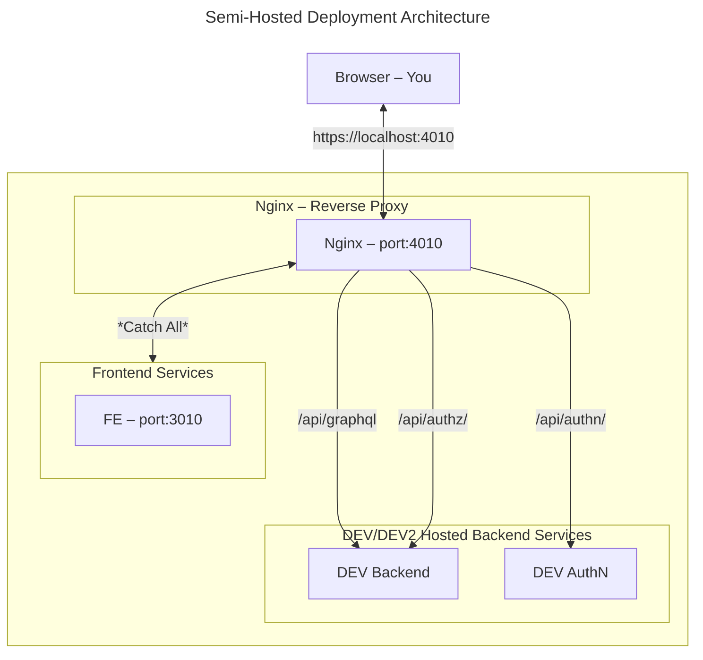
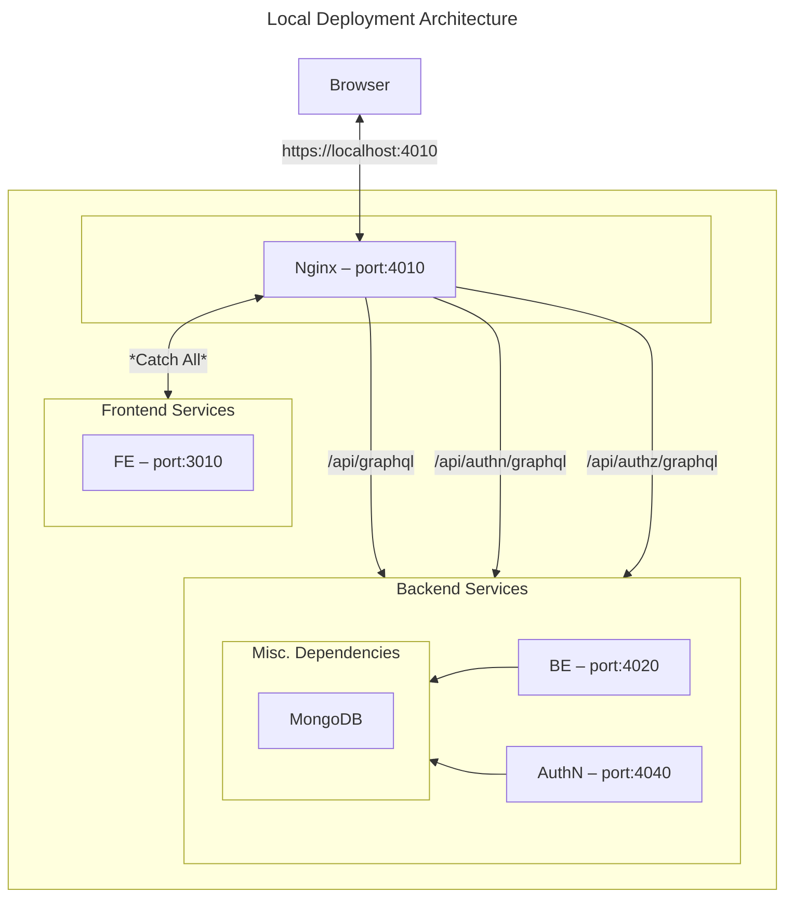

# Overview

This document provides developer documentation on the setup of Nginx for local development.

# NGINX Installation For Mac

Follow this guide to install and configure Nginx for usage with this project. For a understanding of the overall architecture, see the [Deployment Architecture](#deployment-architecture) section.

Install NGINX:

```bash
brew install nginx
```

Remove Default nginx Configuration (Optional)

```bash
rm /usr/local/etc/nginx/nginx.conf.default
rm /usr/local/etc/nginx/nginx.conf
```

Clone the configuration from below

<details>
<summary>Sample Nginx Configuration</summary>

```nginx
worker_processes  1;

events {
    worker_connections  1024;
}

http {
    client_max_body_size 128M;

    server {
        listen       0.0.0.0:4010;
        server_name  localhost;

        # 3.3.0 MIGRATION: Redirect /submissions to /submission-requests
        location /submissions {
            return 301 /submission-requests$is_args$args;
        }
        
        # 3.3.0 MIGRATION: Redirect /submission/:uuid to submission-request/:uuid
        location ~ ^/submission/([a-zA-Z0-9-]+)$ {
            return 301 /submission-request/$1;
        }

        # Authn
        location /api/authn/ {
            # proxy_pass http://localhost:4030/api/authn/;
            # proxy_pass "https://hub-dev.datacommons.cancer.gov/api/authn/";
            proxy_pass "https://hub-dev2.datacommons.cancer.gov/api/authn/";
        }

        # Backend
        location /api/graphql {
            # proxy_pass http://localhost:4040/api/graphql;
            # proxy_pass "https://hub-dev.datacommons.cancer.gov/api/graphql";
            proxy_pass "https://hub-dev2.datacommons.cancer.gov/api/graphql";
        }

        # Frontend
        location / {
            allow all;
            proxy_buffers 8 2048K;  
            proxy_buffer_size 32K;
            proxy_pass http://localhost:3010/;
        }
    }
}
```

</details>

> [!Warning]
> Do not use the Nginx from [../conf/nginx.conf](../conf/nginx.conf) as it is configured for production deployments, not local development.

Start/Restart NGINX

```bash
brew services restart nginx
```

# Deployment Architecture

## Semi-Hosted Deployment (Recommended)

A deployment architecture diagram is shown below using the frontend deployed locally and the backend deployed on the hosted DEV/DEV2 tiers. This avoids the need to install and configure the entire backend tech stack.



## Local Deployment

An overview of the local deployment architecture is shown below using the following locally hosted tech stack:

- Frontend – [crdc-datahub-ui](https://github.com/CBIIT/crdc-datahub-ui)
- Backend – [crdc-datahub-backend](https://github.com/CBIIT/crdc-datahub-backend)
- AuthN – [crdc-datahub-authn](https://github.com/CBIIT/crdcdatahub-authn)
- MongoDB

Please see the individual repos for installation and configuration instructions.


