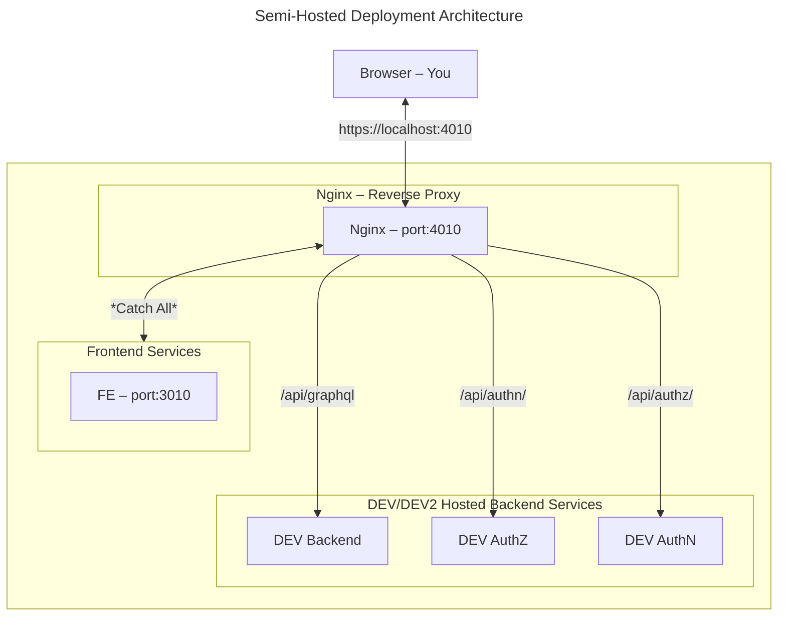
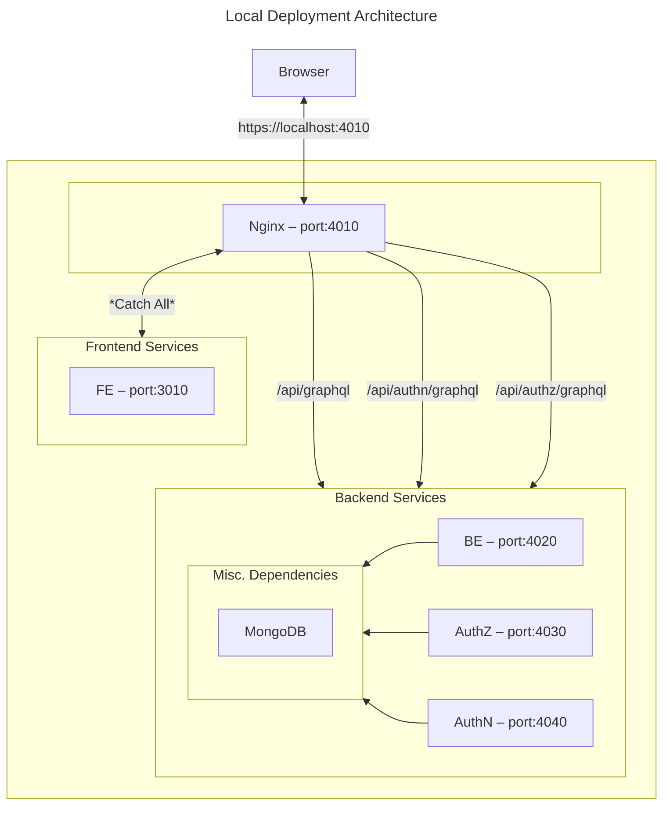

# NGINX Installation For Mac

Follow this guide to install and configure Nginx for usage with this project. For a understanding of the overall architecture, see the [Deployment Architecture](#deployment-architecture) section.

Install NGINX:

```bash
brew install nginx
```

Remove Default NGINX Configuration (Optional)

```bash
rm /usr/local/etc/nginx/nginx.conf.default
rm /usr/local/etc/nginx/nginx.conf
```

Clone Provided Configuration

```bash
cp ./nginx.conf /usr/local/etc/nginx/
```

> **Warning**: Do not confuse the [nginx.conf](./nginx.conf) file in this directory with the one in [conf/nginx.conf](../conf/nginx.conf). The latter is used for
> production deployments.

Start/Restart NGINX

```bash
brew services restart nginx
```

# React App Configuration

See the provided [.env](../.env.example) file for the required environment variables. At a minimum, include:

```properties
# ... other variables

REACT_APP_BACKEND_API="http://localhost:4010/api/graphql"

PORT=3010

# ... other variables
```

> **Note**: After modifying the .env file, you must completely restart the React app for the changes to take effect.

# Deployment Architecture

## Semi-Hosted Deployment (Recommended)

A deployment architecture diagram is shown below using the frontend deployed locally and the backend deployed on the hosted DEV/DEV2 tiers. This avoids the need to install and configure the entire backend tech stack.



## Local Deployment

An overview of the local deployment architecture is shown below using the following locally hosted tech stack:

- Frontend – <https://github.com/CBIIT/crdc-datahub-ui>
- Backend – <https://github.com/CBIIT/crdc-datahub-backend>
- AuthZ – <https://github.com/CBIIT/crdc-datahub-authz>
- AuthN – <https://github.com/CBIIT/crdc-datahub-authn>
- MongoDB

Please see the individual repos for installation and configuration instructions.


